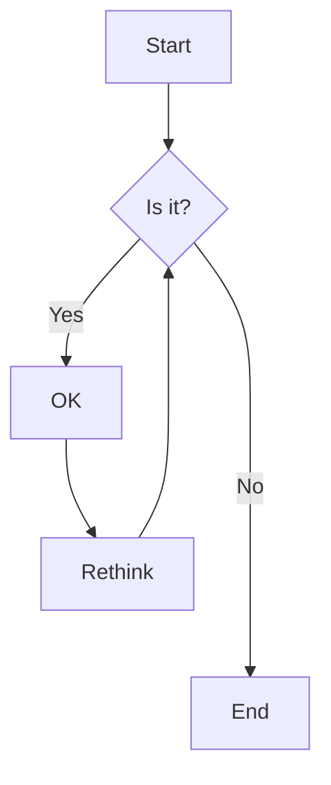

To make a table of contents, you can write the following at top of your article:

\{\{\< &nbsp; toc &nbsp; \>\}\}

The table of contents will appear like this:





Note that in blogs, the Table of Contents is included by default



Here is an example of headings. You can use this heading by the following markdown rules.
For example: use `#` for heading 1 and use `######` for heading 6.

# Heading 1

## Heading 2

### Heading 3

#### Heading 4

##### Heading 5

###### Heading 6

A horizontal line can be drawn with the help of three dashes i.e. `---` or `<hr>` tag.

```
content above horizontal line

---
content below horizontal line
```

Renders like this:

content above horizontal line

---

content below horizontal line

---

### Latex

Firstly, to enable latex support in your document. You must
use `math: true` in your front matter. An example article with
math support would look like:

```markdown
---
author: "your_name"
date: 2026-01-02T16:03:40.480Z
# other properties
math: true
---

// rest of the article
```

Now you can use latex in your document. You can use either `$ /* your code */ $`
or `\\( /* your code */ \\)`for inline latex. And `$$ /* your code */ $$` or
`\\[ /* your code */ \\]` for block latex.


Please note that you need to type `\\` instead of single `\`. This is because, hugo renders
double `\\` as a single slash `\`. And latex renderer is looking for delimiters like either
`\[` or `\(`.


Below are some examples:

1. A linear program

```latex
$$
\begin{align*}
    \text{max} \quad 2x_1 + 5x_2 & \\\\
    \text{s.t.} \quad 4x_1 + 9x_2 &\ge 11 \\\\
                            5x_1 + x_2 &\ge -4 \\\\
                            x_1, x_2 &\ge 0
\end{align*}
$$
```
renders as:

$$
\begin{align*}
    \text{max} \quad 2x_1 + 5x_2 & \\\\
    \text{s.t.} \quad 4x_1 + 9x_2 &\ge 11 \\\\
                            5x_1 + x_2 &\ge -4 \\\\
                            x_1, x_2 &\ge 0
\end{align*}
$$

2. Weight optimization in a neural network using gradient descend:

```latex
$$
    w_{t+1} = w_t - \gamma \cdot \nabla_w f(w)
$$

```

renders as:

$$
    w_{t+1} = w_t - \gamma \cdot \nabla_w f(w)
$$

3. Bayes theorm:

```latex
$$
    P( A \mid B ) = \frac{ P( B \mid A ) \times P(A) }{ P(B) }
$$
```

renders as:

$$
    P( A \mid B ) = \frac{ P( B \mid A ) \times P(A) }{ P(B) }
$$

### Emphasis

```markdown
The emphasis, aka italics, with _asterisks_ or _underscores_.

Strong emphasis, aka bold, with **asterisks** or **underscores**.

The combined emphasis with **asterisks and _underscores_**.

Strike through uses two tildes. ~~Scratch this.~~
```

renders as:

The emphasis, aka italics, with _asterisks_ or _underscores_.

Strong emphasis, aka bold, with **asterisks** or **underscores**.

The combined emphasis with **asterisks and _underscores_**.

Strike through uses two tildes. ~~Scratch this.~~

<hr>

### Button

\{\{\< `button label="Button" link="/your/link" style="solid"` \>\}\}

renders as:



<hr>

### Link

```markdown
[I'm an inline-style link](https://www.google.com)

[I'm an inline-style link with title](https://www.google.com "Google's Homepage")

[I'm a relative reference to a repository file](../blob/master/LICENSE)

URLs and URLs in angle brackets will automatically get turned into links.
<http://www.example.com> or <http://www.example.com> and sometimes
example.com (but not on Github, for example).
```

renders as:

[I'm an inline-style link](https://www.google.com)

[I'm an inline-style link with title](https://www.google.com "Google's Homepage")

[I'm a relative reference to a repository file](../blob/master/LICENSE)

URLs and URLs in angle brackets will automatically get turned into links.
<http://www.example.com> or <http://www.example.com> and sometimes
example.com (but not on Github, for example).

Some text to show that the reference links can follow later.

<hr>

### Paragraph

Just write paragraphs as you normally would or use the `<p> tag </p>`.

Lorem ipsum dolor sit amet consectetur adipisicing elit. Quam nihil enim maxime corporis
cumque totam aliquid nam sint inventore optio modi neque laborum officiis necessitatibus,
facilis placeat pariatur! Voluptatem, sed harum pariatur adipisci voluptates voluptatum.

<hr>

### Ordered List

```markdown
1. List item
2. List item
3. List item
```

renders as:

1. List item
2. List item
3. List item

<hr>

### Unordered List

```markdown
- List item
- List item
```

renders as:

- List item
- List item

<hr>

### Notice

To see how these notes are generated, see the corresponding markdown file in github.


This is a simple note.



This is a simple quote.



This is a simple tip.



This is a simple info.



This is a simple warning.


<hr>

### Tab

See corresponding markdown on Github, to learn how to generate tabbed content.




#### Hey There, I am a tab

Lorem ipsum dolor sit amet, consetetur sadipscing elitr, sed diam nonumy eirmod tempor invidunt ut labore et dolore magna aliquyam erat, sed diam voluptua. At vero eos et accusam et justo duo dolores et ea rebum. Stet clita kasd gubergren, no sea takimata sanctus est Lorem ipsum dolor sit amet.





#### You are the best

Lorem ipsum dolor sit amet, consetetur sadipscing elitr, sed diam nonumy eirmod tempor invidunt ut labore et dolore magna aliquyam erat, sed diam voluptua. At vero eos et accusam et justo duo dolores et ea rebum. Stet clita kasd gubergren, no sea takimata sanctus est Lorem ipsum dolor sit amet.

Lorem ipsum dolor sit amet, consetetur sadipscing elitr, sed diam nonumy eirmod tempor invidunt ut labore et dolore magna aliquyam erat, sed diam voluptua. At vero eos et accusam et justo duo dolores et ea rebum. Stet clita kasd gubergren, no sea takimata sanctus est Lorem ipsum dolor sit amet.





#### We know you’re dealing in stolen ore

Lorem ipsum dolor sit amet, consetetur sadipscing elitr, sed diam nonumy eirmod tempor invidunt ut labore et dolore magna aliquyam erat, sed diam voluptua. At vero eos et accusam et justo duo dolores et ea rebum. Stet clita kasd gubergren, no sea takimata sanctus est Lorem ipsum dolor sit amet.

Lorem ipsum dolor sit amet, consetetur sadipscing elitr, sed diam nonumy eirmod tempor invidunt ut labore et dolore magna aliquyam erat, sed diam voluptua. At vero eos et accusam et justo duo




<hr>

### Accordions



- Lorem ipsum dolor sit amet consectetur adipisicing elit.
- Lorem ipsum dolor sit amet consectetur adipisicing elit.
- Lorem ipsum dolor sit amet consectetur





1. Lorem ipsum dolor sit amet consectetur adipisicing elit.
2. Lorem ipsum dolor sit amet consectetur adipisicing elit.
3. Lorem ipsum dolor sit amet consectetur





- Lorem ipsum dolor sit amet consectetur adipisicing elit.
- Lorem ipsum dolor sit amet consectetur adipisicing elit.
- Lorem ipsum dolor sit amet consectetur



<hr>

### Code and Syntax Highlighting

This is an `Inline code` sample.

```javascript
var s = "JavaScript syntax highlighting";
alert(s);
```

```python
s = "Python syntax highlighting"
print s
```

```c  { linenos=true }
#include <stdio.h>

int main(void)
{
    printf("hello, world\n");
    return 0;
}
```

### Diagram

Diagrams can be generated using [mermaid](https://mermaid.js.org/intro/). For example:



<hr>

### Blockquote

> You can write a block quote using the `>` sign followed by a space and your note.

<hr>

### Tables

```markdown
| Tables        |      Are      |  Cool |
| ------------- | :-----------: | ----: |
| col 3 is      | right-aligned | $1600 |
| col 2 is      |   centered    |   $12 |
| zebra stripes |   are neat    |    $1 |
```
renders as:

| Tables        |      Are      |  Cool |
| ------------- | :-----------: | ----: |
| col 3 is      | right-aligned | $1600 |
| col 2 is      |   centered    |   $12 |
| zebra stripes |   are neat    |    $1 |

<hr>

### Image

There are 3 methods of adding images:

1. use native markdown syntax

```markdown

```

renders like this:


1. Using html `` tag. This gives you more freedom. You can define height, width and other CSS properties. You can also
    use tailwind classes.

```markdown
caption</img>
```

renders like this:

caption</img>

3. Use hugoplate specific syntax:


\{\{\< `image src="https://upload.wikimedia.org/wikipedia/commons/thumb/b/b0/Backprogation_neural_networks.png/640px-Backprogation_neural_networks.png" caption="" alt="alter-text" height="" width="" position="center" command="fill" option="q100" class="img-fluid" title="image title"  webp="false"` \>\}\}




<hr>

### Gallery

Multiple images can be displayed as a gallary. See Github, for more details.



<hr>

### Slider

<!--  -->

You can also add a slider with multiple images, see Github for more details.



<hr>

### Youtube video

Embed youtube videos.



<hr>

### Custom video

Display a custom video.


